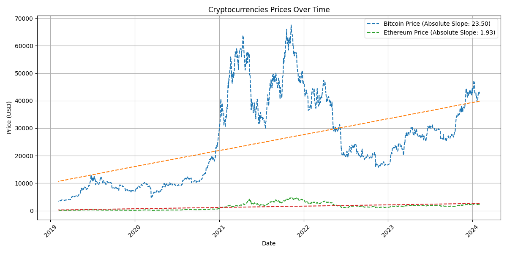
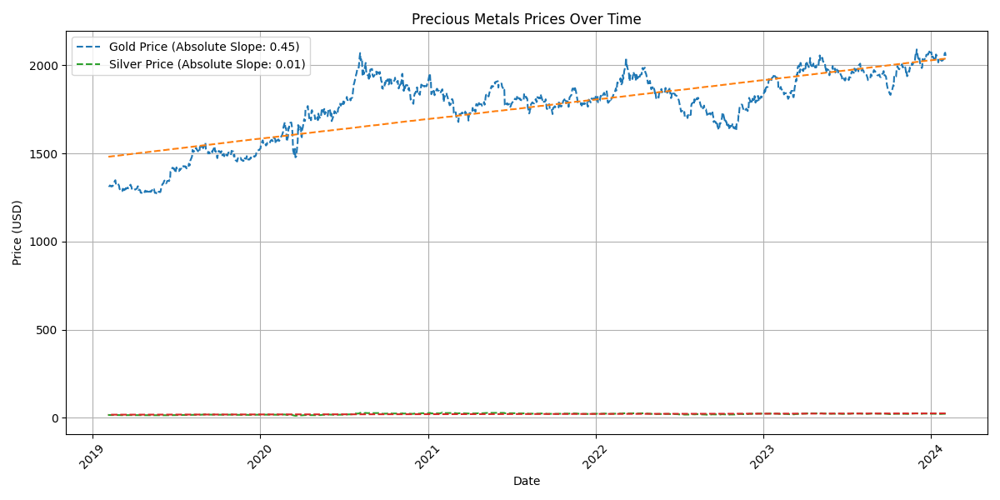
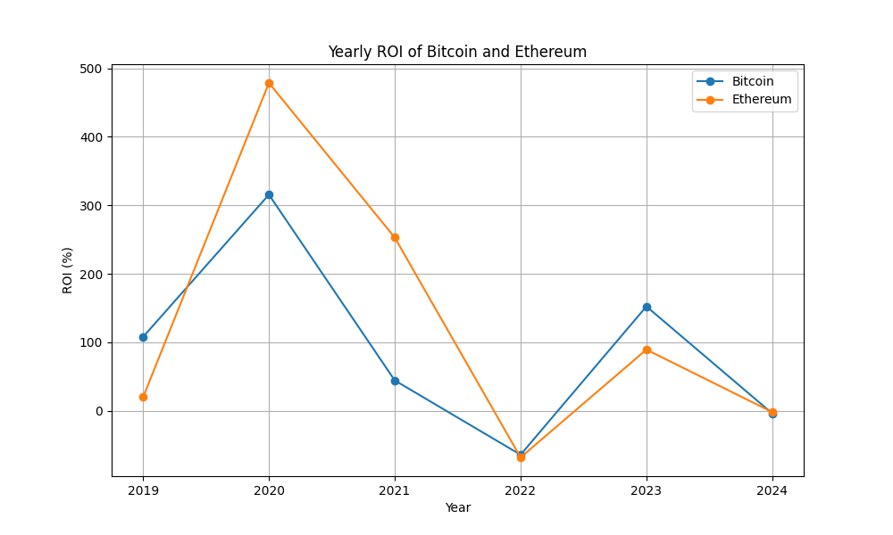
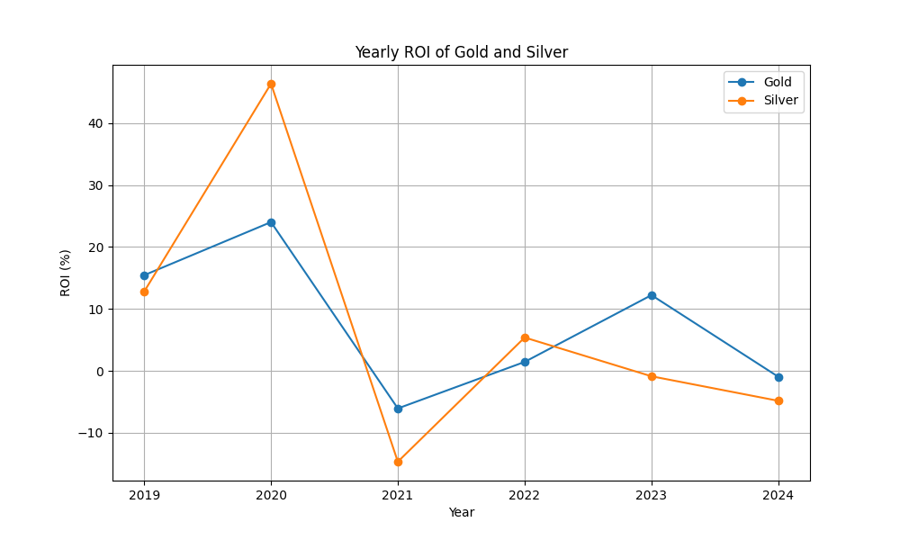
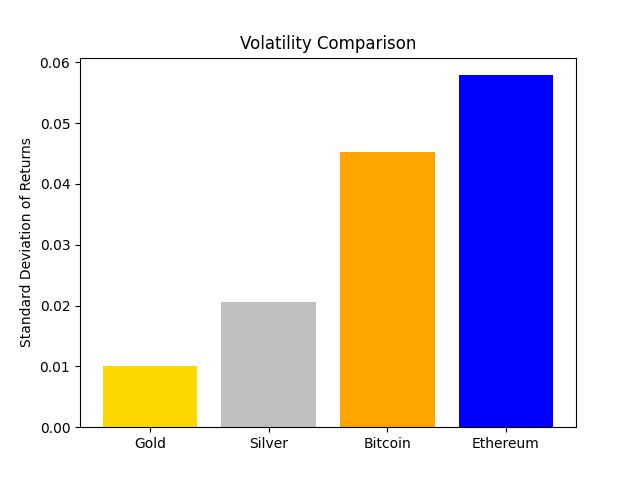
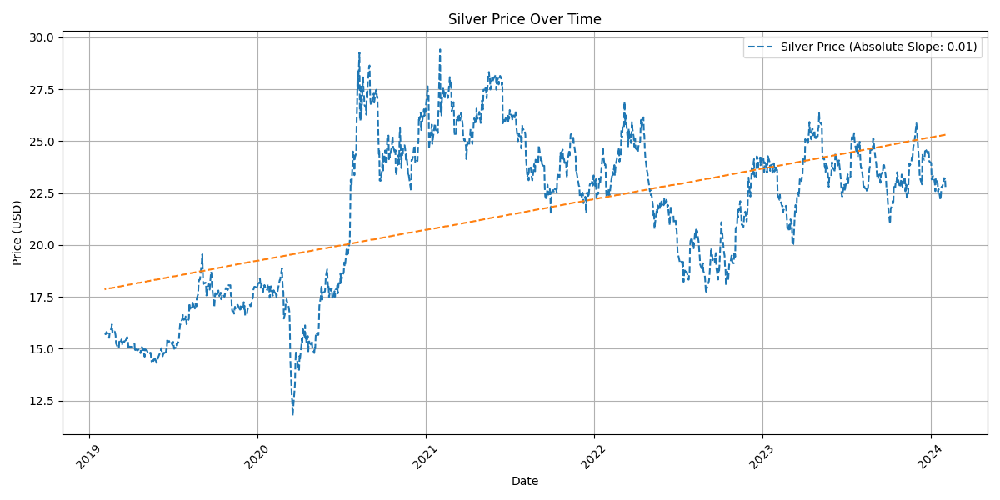

***
# Precious Metals vs Cryptocurrencies analysis [Hugo_analysis_notebook](https://github.com/nicoleanderson21/Project-3/blob/main/Hugo_analysis.ipynb) README

## Introduction

This anlaysis summarizes a detailed study that compares how well cryptocurrencies (Bitcoin and Ethereum) have done compared to precious metals (Gold and Silver) over a few years. It uses different methods to evaluate price trends, returns on investment, and volatility.

## Files

The analysis is supported by visual aids, which include the following charts:

- A graph displaying the price trend lines of Bitcoin and Ethereum over the observed period.

- A graph illustrating the price trend lines of Gold and Silver over time.

- A line graph showing the yearly ROI of Bitcoin and Ethereum.

- A line graph depicting the yearly ROI of Gold and Silver.

- A bar chart comparing the volatility (standard deviation of returns) of all four assets.

- A focused view of the price trend line of Silver.

## Analysis Results

### Price Trends
- Linear regression analysis was applied to assess the overall price trend of each asset. Cryptocurrencies displayed a steeper slope, indicating a more rapid change in prices over time compared to precious metals.

### Returns on Investment (ROI)
- Yearly ROI calculations were plotted to compare the performance of the assets year over year. Cryptocurrencies had higher peaks and sharper falls, signifying higher potential returns but at greater risk.

### Volatility
- As expected, cryptocurrencies showed significantly higher volatility compared to precious metals, which aligns with the wider price swings observed in the crypto market.

### Statistical Significance
- T-tests were conducted to determine if there were statistically significant differences in the ROI of the assets. The results indicated no significant differences between the ROIs of Gold and Silver, and similarly, no significant difference between Bitcoin and Ethereum.

## Conclusion

The study reveals clear differences between precious metals and cryptocurrencies in how they perform as investments. Gold and Silver are shown to be stable assets for preserving wealth. For example, Gold consistently increased by around $0.45 annually, while Silver had a more modest growth rate of approximately $0.01 per year.

In contrast, cryptocurrencies like Bitcoin and Ethereum are much more volatile. Bitcoin, for instance, saw a huge return of 315.52% in 2020, but then dropped sharply to -64.23% in 2022. Similarly, Ethereum had a significant ROI of 478.61% in 2020 but dropped to -68.13% in 2022. These fluctuations highlight the risky nature of cryptocurrencies compared to precious metals.

However, it's important to acknowledge the study's limitations. We only looked at a short period, which may not capture the full picture of market trends. Additionally, our analysis focused mainly on popular metals and cryptocurrencies, potentially overlooking differences in lesser-known assets. External factors like major news events and economic changes could also affect asset values, factors not included in our study.
***
