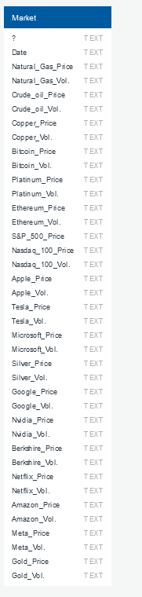

# Project-3
Stock Market Analysis 2019-2024

# Project Overview

This project aims to use stock market data over the last 5 years across various sectors to find trends that can be used by investors, traders, etc. to influence and aid in their decision-making processes. Our findings in particular relate primarily to stock price and trading volume over time. These are the research questions our project aims to answer:
   1. How are the stock prices and trading volumes of big tech companies related and how do they change over time?
   2. How does the change in federal reserve interest rates affect the SP500 stock price?
   3. How does more volume, affect buyers and shareholders and the Price of the stock?
   4. How do the volatilities of returns from precious metals and cryptocurrencies compare over time?

# Instructions

The code used to answer each of the 4 research questions can be found in the 4 python files: "nicole_analysis.ipynb", "[Hugo_analysis.ipynb](https://github.com/nicoleanderson21/Project-3/blob/hugo_branch/README.md)", "Soubhadra_analysis", and "cameron_analysis.ipynb". The original csv and sqlite file can be found in the "Resources" folder, labeled "stock_market_data.csv" and "market.sqlite". The user-driven interaction element can be found in the html file labeled "main.html". Once downloaded and opened, it will take the user to a web page in which several links are available that open separate pages containing our findings. The code for these html files, as well as the images on these pages, can be found in the "sector_htmls" folder and "Images" folder respectively.

# Documentation of the Database

The data is stored in a sqlite database. We chose this because, along with our comfrotability skill-wise, it is stable, compatible, fast, and easy to work with. The database file format is cross-platform, so we were able to upload our csv file directly without having to manually edit data types or headers, and could easily create and engine to communicate with the database in python.

# ETL Workflow

- Extract

   The dataset was initially downloaded as stock_market_data.csv from the following Kaggle dataset: [2019-2024 US Stock Market Data](https://www.kaggle.com/datasets/saketk511/2019-2024-us-stock-market-data).
   Here is the Entity Relationship Diagram of the stock market data after conversion of csv into sqlite file.

- Transform

   We transformed the CSV data by:
     - Cleaning: Removal of irrelevant data, handling missing or erroneous values.
     - Selection: Filtering the dataset to include only the relevant stocks relative to each analysis

- Load

    The transformed data was then loaded into a market.sqlite database, providing a centralized and consistent data source.
    Each team member used this SQLite database to perform their analysis, ensuring uniformity across individual notebooks and analyses.

# Ethical Considerations
We made sure to handle data and analyze it in a fair and moral way. We were transparent by giving credit to websites and sources whenever we used their information. This helped us show respect to the people who originally created the data or ideas we used. We wanted to be honest and accountable, so we included clear references to where we got our information from. This allowed others to check and confirm that our findings were trustworthy.
# Data References

The dataset used for this project was the "2019-2024 US Stock Market Data" csv file found on kaggle.
Link: https://www.kaggle.com/datasets/saketk511/2019-2024-us-stock-market-data
